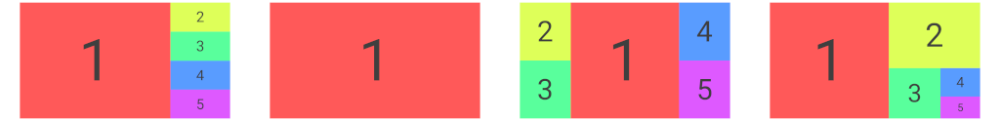
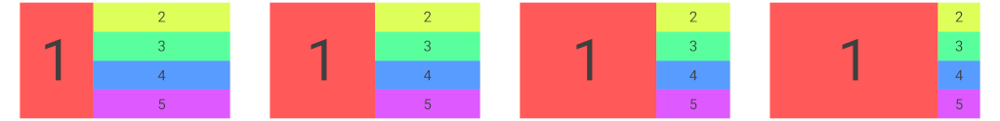
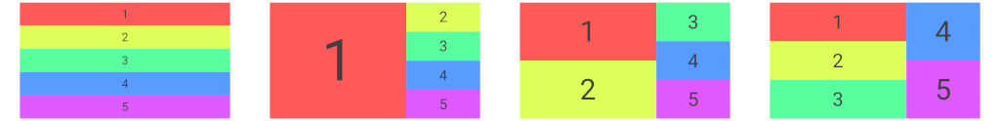

# Vivarium

IRC chat: [#vivarium](https://web.libera.chat/?channels=#vivarium) on [irc.libera.chat:6697](ircs://irc.libera.chat:6697)

A dynamic tiling [Wayland](https://wayland.freedesktop.org/) compositor using [wlroots](https://gitlab.freedesktop.org/wlroots/wlroots), with desktop semantics inspired by [xmonad](https://xmonad.org/).

  

Core features include:

* Automatic/dynamic tiling with your choice of layouts.
* Per-output workspaces: display the workspace you want, where you want.
* Floating windows on demand.
* (optional) XWayland support.
* Layer shell support, compatible with tools like [Waybar](https://github.com/Alexays/Waybar), [bemenu](https://github.com/Cloudef/bemenu) and [swaybg](https://github.com/swaywm/swaybg).
* Damage tracking.

Vivarium is unstable and unfinished...but usable!

## Tiling model

Vivarium lets you define any number of workspaces, each with some number of tiling layouts that you can switch between at runtime. New windows are automatically tiled according to the layout, or can be made floating to be placed anywhere with any size you like. The order of windows within the layout is adjustable at runtime.

You will probably want to set up a small number of layouts, updating their parameters according to your needs. For instance, if you find you need too many terminals to fit in a single stack next to a browser window then you might switch the layout to one that places windows in multiple columns. Or if you want to focus on the browser, you might switch to a fullscreen layout that displays only the active window.

Example layouts include (left to right): split, fullscreen, central column, and recursive split:

  

Most layouts have a main panel displaying the largest window, and a secondary space for the other windows.

Layouts have a "fill fraction" parameter, adjustable at runtime via hotkeys, which controls the size of the main panel:

  

Layouts also have an integer main panel "count", adjustable at runtime via hotkeys, which controls how many windows are stacked in the main panel. It can be zero so that all windows occupy the secondary space:

  

Other per-layout options include whether window borders are displayed, and whether the layout leaves space for programs like the desktop bar or draws windows over their normally-excluded region.

## Build instructions

Get install dependencies. You need:

* meson
* wlroots
* wayland
* wayland-protocols
* xcb

Specific package dependencies for Ubuntu 20.04 can be found in [the Github CI file](.github/workflows/main.yml).

Get Vivarium:

    git clone git@github.com:inclement/vivarium.git
    cd vivarium

Build Vivarium:

    meson build
    ninja -C build

Run Vivarium:

    ./build/src/vivarium

Install Vivarium:

    sudo ninja -C build install

Vivarium expects to be run from a TTY, but also supports embedding in an X session or existing Wayland session out of the box. Running the binary will Do The Right Thing.

## Configuration

Vivarium comes with a default config that you can override by creating your own `config.toml`. You can also adjust the default config at compile time using `viv_config.h`, which is necessary if you want to inject your own code for e.g. custom layouts or adding keypress actions that aren't already provided by Vivarium.

### config.toml

**Use this if:** you've installed Vivarium and want to override its defaults with your own config.

Copy the default config so that Vivarium will find it.

    mkdir -p $HOME/.config/vivarium
    cp config/config.toml $HOME/.config/vivarium

The default config is extensively documented and includes all the Vivarium default bindings. See the documentation inside the file to see what other options you can set.

If you installed Vivarium globally, the default config should instead be found in `/etc/vivarium/config.toml` or `/usr/local/etc/vivarium/config.toml`.

### viv_config.h

**Use this if:** you want to adjust Vivarium's compiled-in default config or write your own C code for layouts or keybinds.

Vivarium automatically uses the configuration struct defined in `viv_config.h`. Edit that file before compiling to update the configuration.

If you'd like to maintain multiple different configs, copy the config directory to somewhere else and tell Vivarium to use the appropriate version at compile time:

    cp -r config myconfig
    meson build_myconfig -Dconfig-dir=myconfig
    ninja -C build_myconfig

### Bar support

Vivarium can automatically start a bar program such as [Waybar](https://github.com/Alexays/Waybar). Only Waybar is currently tested, and only very basic IPC is currently possible, but this is enough to display the current workspace status.

See `viv_config.h` or the `config.toml` for instructions on starting the bar program.

## FAQ (or not-so-FAQ)

> What does "desktop semantics inspired by xmonad" mean?

The core tiling experience provides something similar to xmonad's defaults: new windows are added to the current workspace and tiled automatically within a current layout. Each workspace may independently switch between different layouts. Each output (usually equivalent to each monitor) displays a single workspace, and each may be switched independently. Windows may be made floating and moved/resized smoothly, but this is generally the exception rather than the rule.

Vivarium makes no attempt to rigorously mimic xmonad or to replicate its internal design philosophy. Not least, Vivarium is written in C and is not (for now) so directly and transparently extensible.

> Why do some windows display title bars with maximize/minimize/close buttons that don't do anything?
> Can I turn that off?

Vivarium attempts to tell windows not to draw their own decorations and this works for most applications, but the protocols for doing so are not yet standard or universally supported so some windows still draw their own. For now there's probably nothing you can do about it, but this is likely to improve in the future.

It's also possible that there are bugs in Vivarium's window decoration configuration, bug reports welcome if so.

> What's the status of Vivarium's damage tracking support?

Vivarium supports damage tracking, i.e. drawing only regions of the screen that have actually changed, but this is semi-experimental.

Damage tracking currently defaults to `"frame"`, which draws every frame in which something has changed anywhere on the screen. This is a dramatic improvement on rerendering all your unchanging windows every frame, but even better would be to have full damage tracking that redraws only the small parts of the frame that have actually changed.

To test out full damage tracking, change the config value to `"full"`. This is tested and is thought to work if every monitor has the same scale, but there may be bugs in more complex output configurations. Full damage tracking will become the default as soon as these issues are resolved.

If at any point you find Vivarium fails to render something (e.g. jerky frames, missing menu popups), try setting the config to `"none"`: if this makes it work then you've found a damage tracking issue. Either way, issue reports are [gratefully received](https://github.com/inclement/vivarium/issues).

> Why TOML for configuration? How can I configure dynamic behaviour like my own layouts?

TOML is especially simple and easy to read, and also easy to write and parse. It's intended to support the most common use case where the configuration is something you set up once, then leave for a long time with only occasional tweaks like changing your layouts or adjusting keybinds. The simple TOML syntax makes it easy to tweak minor options even a long time after first writing it, without remembering (for instance) the more complicated syntax of a programming language you don't otherwise use much. (Yes, this is something I found inconvenient about xmonad - I haven't written haskell for years!).

This has the disadvantage that dynamic configuration is not possible using the config.toml: for instance, you can't bind arbitrary functions to keypresses, only the predefined actions hardcoded in Vivarium. In these cases you can instead configure Vivarium via C code using the `viv_config.h` header described in the Configuration section, but you will need to recompile Vivarium each time you update the config.

In the longer term I would like to explore providing Vivarium as a library so that you can run Vivarium, and inject arbitrary event handlers, from any language with a FFI. However, this is not an immediate goal.

> Does Vivarium support $PROTOCOL? Will it in the future?

I'm aiming to support all the core wayland protocols plus all the extra ones being developed under wlroots. However, there is no ETA for specific protocols right now.

Currently supported protocols (though all may be incomplete or buggy in places, none are battle tested):

* XDG shell
* XDG output
* XDG decoration
* XWayland
* Layer shell

> Can you add $FEATURE?

I'm not sure! At the time of writing Vivarium is a personal project whose design philosophy isn't fully determined. Suggestions and requests are welcome.

> Something didn't work! What should I do?

Please check if the issue has [already been reported](https://github.com/inclement/vivarium/issues).

If not, [report a new issue](https://github.com/inclement/vivarium/issues/new).
